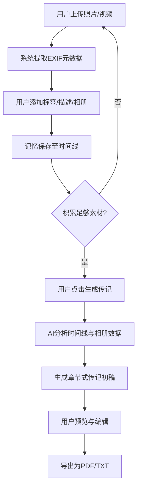

## 1. 产品概述

**"时光簿"** —— 一个个人记忆管理平台，帮助用户收集、整理生活中的珍贵照片与视频，记录每一个重要时刻。随着时间积累，AI将基于这些素材自动生成属于你的个人传记，让回忆不再散落，让人生故事得以传承。

- 目标用户：注重家庭记忆保存的个人用户，尤其是希望为未来留下人生故事的中老年群体
- 核心价值：将碎片化的生活记忆系统化整理，并通过AI技术将其转化为可阅读、可分享的个人传记

## 2. 核心功能

### 2.1 用户角色

| 角色 | 注册方式 | 核心权限 |
|------|----------|----------|
| 个人用户 | 邮箱注册 | 上传媒体、管理相册、生成传记 |
| 家庭成员 | 邀请码加入 | 查看共享相册、上传至共享相册 |

### 2.2 功能模块

1. **首页/时间线**：按时间线展示所有记忆，支持年/月切换，瀑布流照片展示
2. **相册管理**：创建相册、分类管理（节假日、旅行、日常、里程碑等）、拖拽排序
3. **媒体上传**：批量上传照片/视频，自动识别拍摄时间，添加标签/描述/人物/地点
4. **AI传记**：基于时间线和相册数据，AI生成章节式传记，支持编辑和导出
5. **记忆详情**：单张照片/视频大图查看，编辑元数据，关联记忆

### 2.3 页面详情

| 页面名称 | 模块名称 | 功能描述 |
|----------|----------|----------|
| 首页/时间线 | 年份导航栏 | 点击年份快速跳转，当前年份高亮 |
| 首页/时间线 | 时间线瀑布流 | 瀑布流展示照片，鼠标悬停显示日期和描述 |
| 首页/时间线 | 统计摘要 | 显示总照片数、视频数、时间跨度、相册数 |
| 相册管理 | 相册列表 | 卡片式展示相册封面、名称、数量、时间范围 |
| 相册管理 | 创建相册 | 输入名称、选择分类、设置封面、添加成员 |
| 相册管理 | 相册详情 | 网格展示相册内媒体，支持筛选和排序 |
| 媒体上传 | 拖拽上传区 | 支持拖拽/点击批量上传，显示上传进度 |
| 媒体上传 | 元数据编辑 | 为每张媒体添加日期、地点、人物标签、描述、事件标签 |
| 媒体上传 | 智能识别 | 自动读取EXIF信息提取拍摄时间和GPS位置 |
| AI传记 | 传记预览 | 章节式传记内容展示，时间轴与文字交织 |
| AI传记 | 生成控制 | 选择时间范围、章节风格（正式/轻松/诗意）、语言 |
| AI传记 | 编辑与导出 | 在线编辑传记文字，导出为PDF/TXT |
| 记忆详情 | 媒体查看器 | 全屏查看照片/播放视频，左右翻页浏览 |
| 记忆详情 | 元数据面板 | 显示和编辑拍摄时间、地点、人物、描述、关联相册 |
| 记忆详情 | 关联记忆 | 展示同一时间段/同一事件的相似记忆 |

## 3. 核心流程

### 3.1 记忆收集流程
用户打开应用 → 进入上传页面 → 拖拽或选择照片/视频 → 系统自动提取EXIF信息 → 用户补充标签和描述 → 选择归入相册 → 保存至时间线

### 3.2 AI传记生成流程
用户进入AI传记页面 → 选择时间范围和风格 → 点击"生成传记" → 系统基于相册数据和时间线分析 → AI生成章节式传记初稿 → 用户预览并编辑 → 导出保存

## 4. 用户界面设计

### 4.1 设计风格

- **主色调**：暖棕金（#B8860B）与象牙白（#FFFFF0），传递温暖怀旧感
- **辅助色**：深墨绿（#2F4F4F）用于文字与对比，浅杏色（#FFE4C4）用于背景过渡
- **按钮风格**：圆角柔和，hover时微光效果，主按钮暖棕金底白字
- **字体**：标题使用 "Playfair Display"（衬线体，古典优雅），正文使用 "Noto Sans SC"（中文友好，清晰易读）
- **布局风格**：左侧导航栏 + 右侧内容区，卡片式布局，时间线纵向贯穿
- **图标风格**：线性图标，线条偏细（lucide-react），配合暖色调

### 4.2 页面设计概览

| 页面名称 | 模块名称 | UI元素 |
|----------|----------|--------|
| 首页/时间线 | 年份导航 | 侧边垂直年份列表，当前年份高亮金色，hover淡入背景 |
| 首页/时间线 | 瀑布流 | 多列瀑布流，照片卡片圆角阴影，hover轻微放大+显示浮层 |
| 首页/时间线 | 统计摘要 | 顶部水平条，4个数据指标，图标+数字+标签 |
| 相册管理 | 相册卡片 | 封面图占上方2/3，下方名称+数量+日期，hover封面微缩放 |
| 相册管理 | 创建表单 | 模态对话框，居中弹出，暖色背景 |
| 媒体上传 | 上传区域 | 虚线边框大区域，拖入时边框变为金色脉冲动画 |
| 媒体上传 | 进度条 | 水平进度条，金色填充，百分比文字 |
| 媒体上传 | 元数据面板 | 右侧抽屉面板，字段分组排列 |
| AI传记 | 传记阅读区 | 居中大段排版，衬线字体，章节标题金色下划线，配图穿插 |
| AI传记 | 侧边控制栏 | 左侧窄栏，滑块选择时间范围，风格按钮组 |
| AI传记 | 编辑模式 | 行内编辑，文字区域暖色边框高亮 |
| 记忆详情 | 查看器 | 全屏暗色背景，照片居中，底部缩略图条 |
| 记忆详情 | 元数据面板 | 右侧滑出面板，浅暖色背景，字段可编辑 |

### 4.3 响应式设计

- 桌面优先设计，宽屏利用空间展示多列瀑布流
- 平板：导航折叠为顶部标签栏，瀑布流2列
- 手机：底部标签导航，瀑布流单列，上传区全屏，传记阅读器优化触摸翻页

### 4.4 视觉氛围

- 整体氛围：温暖、怀旧、优雅，像翻阅一本老式相册
- 背景使用淡暖色渐变+轻微纸张纹理
- 照片卡片使用柔和阴影，模拟实体照片放置于桌面的效果
- 页面切换使用淡入淡出过渡，传记页面使用书页翻动效果
