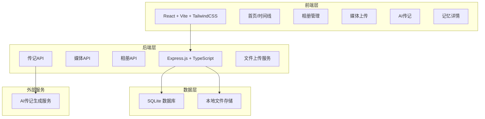
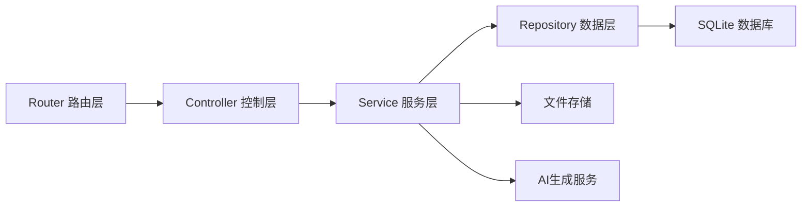
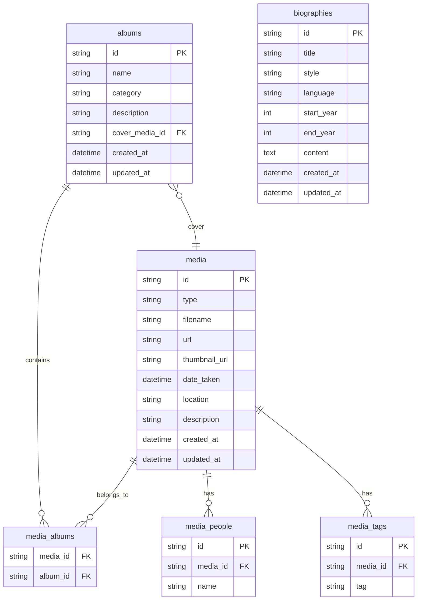

## 1. 架构设计



## 2. 技术说明

- **前端**：React@18 + TailwindCSS@3 + Vite
- **初始化工具**：vite-init（react-express-ts模板）
- **后端**：Express@4 + TypeScript（ESM格式）
- **数据库**：SQLite（better-sqlite3），轻量级本地存储
- **文件存储**：本地文件系统，存储于 `uploads/` 目录
- **状态管理**：Zustand
- **路由**：react-router-dom（前端），Express Router（后端）
- **AI传记**：通过后端调用AI接口生成，前端展示

## 3. 路由定义

| 路由 | 用途 |
|------|------|
| `/` | 首页/时间线，展示所有记忆 |
| `/albums` | 相册管理，列表与创建 |
| `/albums/:id` | 相册详情，展示相册内媒体 |
| `/upload` | 媒体上传页 |
| `/biography` | AI传记生成与阅读 |
| `/media/:id` | 单个媒体详情查看 |

## 4. API定义

### 4.1 媒体API

```typescript
// POST /api/media/upload - 批量上传媒体
interface UploadResponse {
  items: MediaItem[]
}

// GET /api/media - 获取媒体列表（分页）
interface MediaListQuery {
  page?: number
  pageSize?: number
  year?: number
  month?: number
  albumId?: string
  tag?: string
}
interface MediaListResponse {
  items: MediaItem[]
  total: number
  page: number
  pageSize: number
}

// GET /api/media/:id - 获取单个媒体详情
// PUT /api/media/:id - 更新媒体元数据
interface MediaItemUpdate {
  description?: string
  dateTaken?: string
  location?: string
  people?: string[]
  tags?: string[]
  albumIds?: string[]
}

// DELETE /api/media/:id - 删除媒体

interface MediaItem {
  id: string
  type: "photo" | "video"
  filename: string
  url: string
  thumbnailUrl: string
  dateTaken: string
  location: string
  description: string
  people: string[]
  tags: string[]
  albumIds: string[]
  createdAt: string
  updatedAt: string
}
```

### 4.2 相册API

```typescript
// GET /api/albums - 获取相册列表
interface AlbumListResponse {
  items: Album[]
}

// POST /api/albums - 创建相册
interface AlbumCreate {
  name: string
  category: "holiday" | "travel" | "daily" | "milestone" | "other"
  description?: string
  coverMediaId?: string
}

// GET /api/albums/:id - 获取相册详情
// PUT /api/albums/:id - 更新相册
// DELETE /api/albums/:id - 删除相册
// POST /api/albums/:id/media - 向相册添加媒体
// DELETE /api/albums/:id/media/:mediaId - 从相册移除媒体

interface Album {
  id: string
  name: string
  category: "holiday" | "travel" | "daily" | "milestone" | "other"
  description: string
  coverUrl: string
  mediaCount: number
  dateRange: { start: string; end: string }
  createdAt: string
  updatedAt: string
}
```

### 4.3 传记API

```typescript
// POST /api/biography/generate - 生成传记
interface BiographyGenerateRequest {
  startYear?: number
  endYear?: number
  style: "formal" | "casual" | "poetic"
  language: "zh" | "en"
}

// GET /api/biography - 获取传记列表
// GET /api/biography/:id - 获取传记详情
// PUT /api/biography/:id - 更新传记内容
// DELETE /api/biography/:id - 删除传记

interface Biography {
  id: string
  title: string
  style: "formal" | "casual" | "poetic"
  language: "zh" | "en"
  chapters: BiographyChapter[]
  startYear: number
  endYear: number
  createdAt: string
  updatedAt: string
}

interface BiographyChapter {
  title: string
  content: string
  mediaIds: string[]
  year: number
}
```

### 4.4 统计API

```typescript
// GET /api/stats - 获取概览统计
interface StatsResponse {
  totalPhotos: number
  totalVideos: number
  totalAlbums: number
  yearSpan: number
  earliestDate: string
  latestDate: string
  tagCloud: { tag: string; count: number }[]
}
```

## 5. 服务端架构图



## 6. 数据模型

### 6.1 数据模型定义



### 6.2 数据定义语言

```sql
CREATE TABLE media (
  id TEXT PRIMARY KEY,
  type TEXT NOT NULL CHECK(type IN ('photo', 'video')),
  filename TEXT NOT NULL,
  url TEXT NOT NULL,
  thumbnail_url TEXT NOT NULL,
  date_taken DATETIME,
  location TEXT DEFAULT '',
  description TEXT DEFAULT '',
  created_at DATETIME DEFAULT CURRENT_TIMESTAMP,
  updated_at DATETIME DEFAULT CURRENT_TIMESTAMP
);

CREATE TABLE albums (
  id TEXT PRIMARY KEY,
  name TEXT NOT NULL,
  category TEXT NOT NULL CHECK(category IN ('holiday', 'travel', 'daily', 'milestone', 'other')),
  description TEXT DEFAULT '',
  cover_media_id TEXT,
  created_at DATETIME DEFAULT CURRENT_TIMESTAMP,
  updated_at DATETIME DEFAULT CURRENT_TIMESTAMP,
  FOREIGN KEY (cover_media_id) REFERENCES media(id) ON DELETE SET NULL
);

CREATE TABLE media_albums (
  media_id TEXT NOT NULL,
  album_id TEXT NOT NULL,
  PRIMARY KEY (media_id, album_id),
  FOREIGN KEY (media_id) REFERENCES media(id) ON DELETE CASCADE,
  FOREIGN KEY (album_id) REFERENCES albums(id) ON DELETE CASCADE
);

CREATE TABLE media_people (
  id TEXT PRIMARY KEY,
  media_id TEXT NOT NULL,
  name TEXT NOT NULL,
  FOREIGN KEY (media_id) REFERENCES media(id) ON DELETE CASCADE
);

CREATE TABLE media_tags (
  id TEXT PRIMARY KEY,
  media_id TEXT NOT NULL,
  tag TEXT NOT NULL,
  FOREIGN KEY (media_id) REFERENCES media(id) ON DELETE CASCADE
);

CREATE TABLE biographies (
  id TEXT PRIMARY KEY,
  title TEXT NOT NULL,
  style TEXT NOT NULL CHECK(style IN ('formal', 'casual', 'poetic')),
  language TEXT NOT NULL CHECK(language IN ('zh', 'en')),
  start_year INTEGER,
  end_year INTEGER,
  content TEXT NOT NULL,
  created_at DATETIME DEFAULT CURRENT_TIMESTAMP,
  updated_at DATETIME DEFAULT CURRENT_TIMESTAMP
);

CREATE INDEX idx_media_date_taken ON media(date_taken);
CREATE INDEX idx_media_type ON media(type);
CREATE INDEX idx_media_albums_album ON media_albums(album_id);
CREATE INDEX idx_media_people_media ON media_people(media_id);
CREATE INDEX idx_media_tags_media ON media_tags(media_id);
CREATE INDEX idx_media_tags_tag ON media_tags(tag);
CREATE INDEX idx_biographies_created ON biographies(created_at);
```
